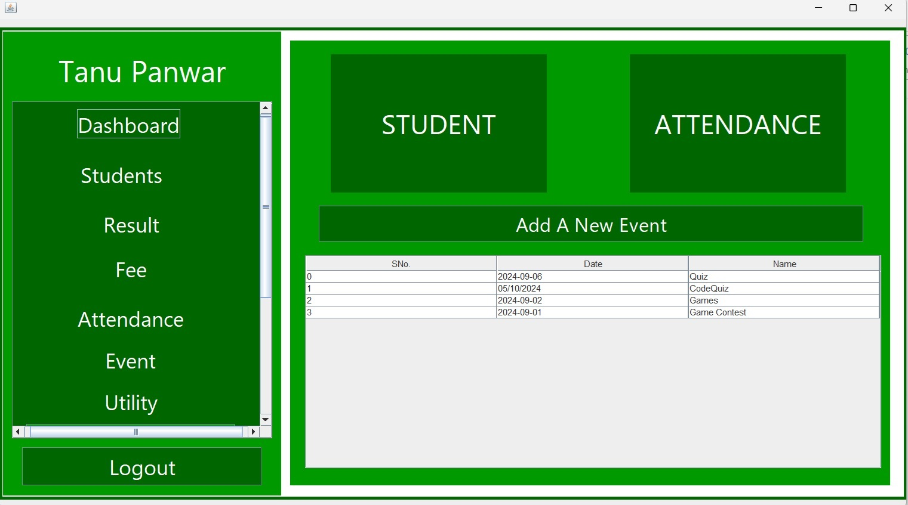
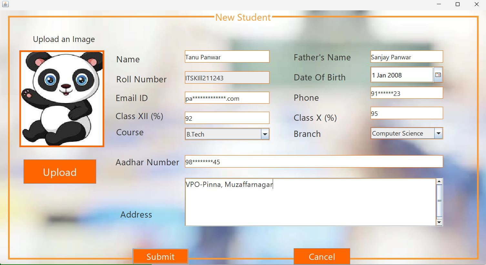
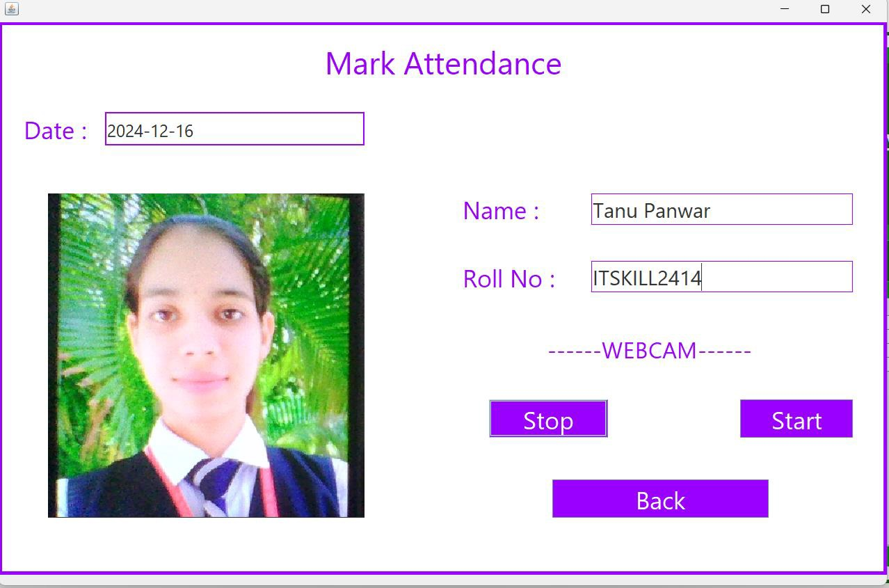

# 📚 Student Management Desktop Application 🎓

A robust **Java-based desktop Student Management System** built using **Swing** and **AWT**, designed to streamline campus administrative tasks. This offline application provides a seamless user experience with key automation features for academic institutions.

---

## 🚀 Features

- 📸 **QR Webcam Attendance** – Scan and log attendance using webcam-enabled QR code recognition.
- 📅 **Dynamic Event Scheduling** – Plan and manage academic events with a flexible scheduler.
- 💰 **Automated Fee Management** – Easily handle fee submissions, due tracking, and financial records.
- 📝 **Result Management System** – Enter, update, and auto-calculate student academic performance.
- 📊 **Powerful Dashboard** – Real-time insights and overviews for student data, performance, and finances.
- 🖥️ **Smooth Desktop UI** – Responsive and intuitive interface using Java Swing & AWT.
- 📴 **Offline Functionality** – Full functionality without requiring an internet connection.

---

## 🛠️ Tech Stack

- **Language:** Java  
- **UI Framework:** AWT & Swing  
- **IDE:** Apache NetBeans  
- **Database:** MySQL  

---

## 🖼️ Screenshots

| Login | Dashboard |
|-------|-----------|
|  |  |

| New Student | Attendance |
|-------------|------------|
|  |  |

---

## 📦 Clone the Repository

```bash
git clone https://github.com/Tanu-panwar/Student_Management_Application.git
